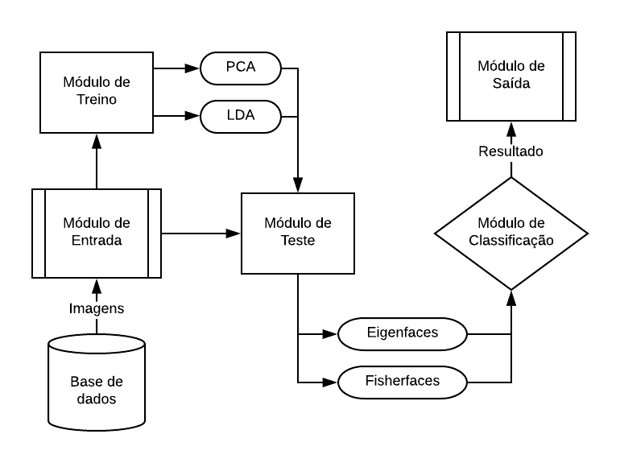
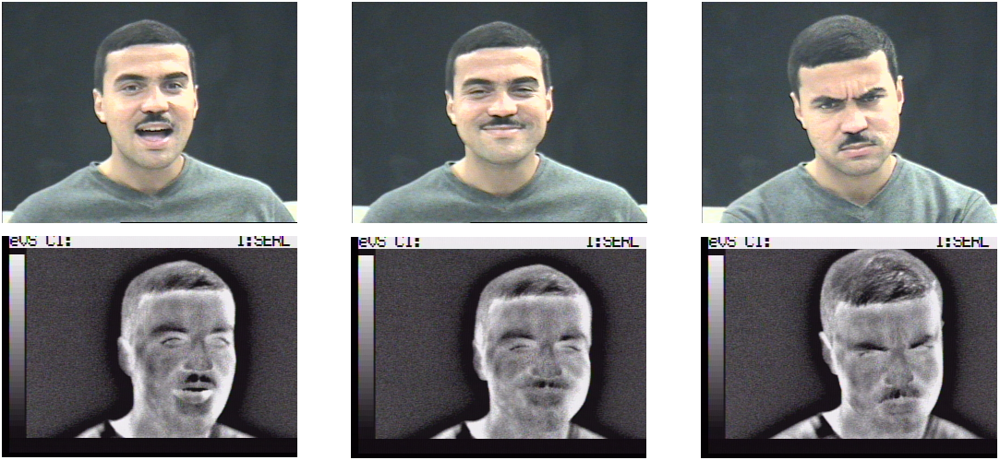
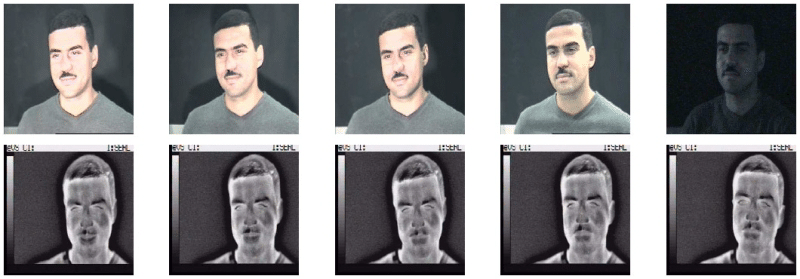

# Reconhecimento Facial Infravermelho

[](https://svgshare.com/i/Zhy.svg)

> ⚠️ Implementação em **matlab** dos algoritmos de reconhecimento facial **Eigenfaces** e **Fisherfaces** para o trabalho de conclusão de curso [**_Reconhecimento facial aplicado a imagens infravermelhas: um estudo comparativo utilizando abordagens holísticas_**](https://repositorio.ufu.br/handle/123456789/23846).

## Overview

Este projeto apresenta um estudo comparativo abordando a utilização de imagens no espectro visível e infravermelho para o reconhecimento facial. Para isso, são utilizados os algoritmos **Eigenfaces** e **Fisherfaces**, baseados na **Principal Component Analysis (PCA)** e na **Linear Discriminant Analysis (LDA)**, respectivamente. A classificação é feita utilizando o **k-Nearest Neighbors (k-NN)**, e os testes foram executados variando a métrica de similaridade entre as distancias: **Euclidiana**, **Manhattan**, **Chebyshev** e **Mahalanobis**. Além disso, foram testadas variações nos valores de **k** e no número de componentes principais utilizadas para a redução de dimensionalidade e projeção das imagens. A figura a seguir ilustra o pipeline do sistema:



## Base de Dados

A base de dados escolhida para os testes foi o [**_IRIS Thermal/Visible Face Database_**](http://vcipl-okstate.org/pbvs/bench/Data/02/download.html), disponibilizado pelo Imaging, Robotics, and Intelligent Systems Laboratory (IRIS), que fica localizado na Universidade do Tennessee, em Knoxville. O banco é composto por 31 conjuntos de imagens de 320×240 pixels, colhidas de 30 indivíduos, sendo que um deles possui imagens de alguns desses indivíduos utilizando disfarces e máscaras. Cada conjunto contém aproximadamente 11 pares de imagens registradas simultaneamente, uma para o espectro visível e outra no infravermelho, expostas a cada uma das variações abordadas pela base de dados, da seguinte maneira:

- **Expressão**: Surpresa, alegria e raiva. 
- **Iluminação**: Luz esquerda acesa (Lon), luz direita acesa (Ron), duas luzes acesas (2on), duas luzes apagadas (Off) e todas as luzes apagadas (Dark). 

Cada imagem presente na base de dados possui em seu nome um prefixo onde um **_V (Visible)_** indica que ela pertence ao espectro visível, e a letra **_L (Long Wavelength Infrared)_** indica que pertence ao espectro infravermelho. Em seguida, aparece uma série de números que identificam os pares de imagens, de maneira que cada contraparte possui a mesma sequência numérica, facilitando a identificação. Os diretórios do banco de imagens estão dispostos da seguinte maneira:

```text
.
├── Indivíduo 1
|   ├── Expressão
|   |   ├── Expressão 1
|   |   |   ├── L-156.bmp
|   |   |   ├── L-158.bmp
|   |   |   ├── ...
|   |   |   ├── V-156.bmp
|   |   |   ├── V-158.bmp
|   |   |   └── ...
|   |   ├── Expressão 2
|   |   └── Expressão 3
|   └── Iluminação
|       ├── 2on
|       |   ├── L-598.bmp
|       |   └── ...
|       ├── Dark
|       ├── Lon
|       ├── Off
|       └── Ron
├── Indivíduo 2
|
...
```

A escolha do UTK-IRIS se deu pelo fato de que este é o único banco que possui pares de imagens do espectro visível e infravermelho, onde há variação de iluminação, posição e expressão simultaneamente. A maneira que as luzes foram posicionadas, não gera uma diferença notável nas sombras projetadas sobre o rosto, porém as imagens com as duas luzes apagadas e o quarto escuro oferecem variações de iluminação similares às encontradas em aplicações reais desses tipos sistemas. Desta maneira, as imagens podem ser úteis na comparação das taxas de reconhecimento em cenários com 3 tipos de iluminação: boa, média e ruim.

No entanto, os conjuntos de imagens contendo disfarces, como por exemplo óculos, máscaras e perucas, foram ignorados por possuírem poucos exemplares, além de uma pequena quantidade de indivíduos, não apresentando as condições necessárias para a produção de resultados relevantes. Dentro dos diretórios de alguns indivíduos, também existiam conjuntos de imagens nomeados "_glasson_" e "_glassoff_", indicando uma sessão extra de fotografias na qual a pessoa colocou ou removeu o par de óculos que portava. Essas imagens também não foram utilizadas, pois não abrangiam todas as variações de iluminação e expressões originais. Além disso, pequenas adaptações alterações precisaram ser realizadas sobre os arquivos originais:

1. Remover arquivo **.avi** do diretório pertencente ao indivíduo **1**
2. Remover imagem extra do diretório pertencente ao indivíduo **2**
3. Remover o diretório pertencente ao indivíduo **14** (**Meng2**)
4. Remover todos os diretórios **glassoff** e **glasson**
5. Remover arquivos **.thumb**

## Execução

Para reproduzir os resultados do trabalho, basta fazer o download da base de dados, aplicar as correções e gerar o conjunto de treino utilizando o arquivo **_Gera_Treino.m_**, substituindo o caminho para o diretório contendo as imagens. Em seguida, é necessário gerar os conjuntos de teste para ambos os métodos, utilizando os arquivos **_Gera_Teste_Eigenfaces.m_** e **_Gera_Teste_Fisherfaces.m_**. As comparações entre as diversas variações do modelo podem ser obtidas utilizando os arquivos **_Gera_Estatisticas..._**, e testes para entradas específicas podem ser feitos utilizando os arquivos **_Teste_Eigenfaces_Single.m_** e **_Teste_Fisherfaces_Single.m_**. Todas as funções auxiliares para leitura, normalização, projeção, reconstrução e classificação de imagens estão localizadas no diretório **_Outras_**. Por fim, as implementações do **_Eigenfaces_** e do **_Fisherfaces_** estão dispostas nos seus respectivos diretórios.
